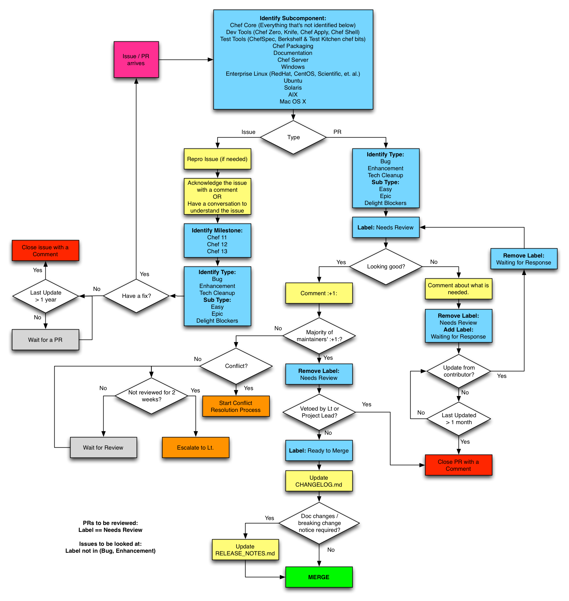

---
RFC:
Author: Serdar Sutay <serdar@getchef.com>
Status: Draft
Type: Process
---

# Chef GitHub Issues Workflow

This RFC codifies the workflow Chef uses to track bug reports and contributions using [GitHub Issues](https://github.com/opscode/chef/issues).
The terms and policies used in this workflow are defined by [RFC 30](https://github.com/chef/chef-rfc/blob/master/rfc030-maintenance-policy.md).

## Terms

In the context of this document below terms are used:

* **Chef Users:** End users of Chef who participate in this workflow by filing **issues**.
* **Contributors:** Users of Chef who would like to improve Chef. They participate in this workflow by submitting **contributions** to Chef.
* **Chef Maintainers:** Developers of Chef who are responsible for one or more **subcomponents**.
* **Lieutenants:** Developers of Chef who lead the maintenance of a subcomponent.
* **Issue**: A filed **GitHub Issue** which can be a bug report, feature request, style change request.
* **Contribution**: A filed **GitHub Pull Request** (PR).
* **Subcomponents**: A sub-area of Chef project which is lead by a **Lieutenant** and a set of **maintainers**.

## Goals

Everyone can:

* Make contributions in a timely and efficient manner

Chef Users can:

* Be aware of the cause & the next steps for the issues they have filed.

Contributors can:

* Identify the state of their contribution.

Chef Maintainers can:

* See the list of contributions they need to review in a single page.
* See the list of issues they need to investigate in a single page.

## Workflow

## Notes

### Common Steps for Issues & PRs

The first step of Chef GitHub Issues Workflow is to identify the subcomponent for which the issue or PR belongs to. Once the subcomponent is identified, the rest of the workflow is the responsibility of the maintainers of the identified subcomponent.

### Issues Workflow

The issues workflow can be broken down into these high level steps:

1. Understand the issue and determine the resolution.
1. Identify the major version the issue should be fixed in.
1. Label the issue to indicate completeness of **Triage** process.

Any code or contributions associated with the issue will follow the
contribution workflow documented below.

#### Rules

* If an issue is not commented on for more than a year, the issue is retired by closing.

### Contribution Workflow

The contribution workflow can be broken down into these high level steps:

1. Maintainers check the contribution and give **:+1:** if the code is looking good, or leave a comment that clearly identifies what is needed for the contribution to move forward.
1. Once at least two maintainers **:+1:** a PR, the last reviewer should:
  * If clean up, such as a Changelog entry or a rebase, is required, mark the PR with the `Ready to Merge` label.
  * If no further work is required, merge the PR.
1. PRs marked with `Ready to Merge` will be merged by maintainers of the subcomponent after including the required documentation updates.
1. `Waiting for Contributor Response` label indicates that an action is needed from the contributor.
1. `Needs Maintainer Review` label indicates that an action is needed from Chef maintainers.

#### Rules

* PRs labeled with `Waiting for Contributor Response` and not updated for more than a month are labelled as `Incomplete Contribution`.
* PRs labeled with `Incomplete Contribution` for 6 months are closed.
* PRs labeled with `Needs Maintainer Review` and not reviewed for 2 weeks escalate to the Lieutenants of the subcomponent.
* PRs labeled with `Ready to Merge` and not merged for 2 weeks escalate to the Lieutenants of the subcomponent.

## Queries

* List of PRs that need review for a subcomponent:
  * Search Query: `is:open is:pr label:"Needs Maintainer Review" label: "subcomponent_name"`
  * **TODO** Add link to the query
* List of Issues that need investigation for a subcomponent:
  * Search Query: `is:open is:issue label:"subcomponent_name" -label:Bug -label:Enhancement -label:"Tech Cleanup"`
  * **TODO** Add link to the query
