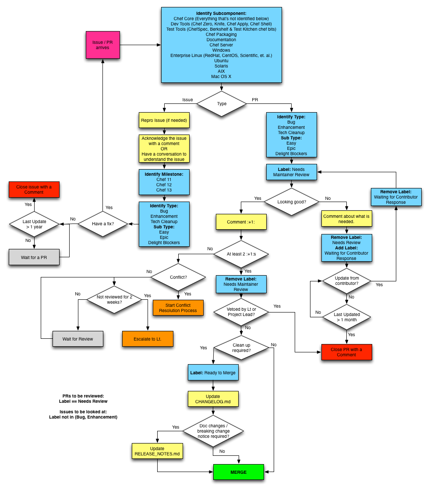

---
RFC:
Author: Serdar Sutay <serdar@getchef.com>
Status: Draft
Type: Process
---

# Chef GitHub Issues Workflow

Here at Chef, we track our issues and contributions using [GitHub Issues](https://github.com/opscode/chef/issues). This RFC codifies the workflow we're using while maintaining our projects in order to make a few things clear:

* State of a contribution (pull request - PR) is visible when a user checks it out.
* Chef maintainers can see the list of PRs which needs review.
* Chef maintainers can see the list of issues to investigate.

## Workflow

### Common Steps for Issues & PRs

The first step is to identify the subcomponent for which the issue or PR belongs to. This step is the responsibility of **Core Chef** Maintainers.

Once the subcomponent is identified, the rest of the workflow is the responsibility of the maintainers of the identified subcomponent.

### Issues Workflow

Issues workflow can be broken down into these high level steps:

1. Understand the issue and determine the resolution.
1. Identify the major version the issue should be fixed in.
1. Label the issue to indicate completeness of **Triage** process.

After this point any fix for an issue should follow the contribution workflow.

#### Additional Policy

* If an issue is not updated for more than a year, the issue is retired by closing.

### Contribution Workflow

Contribution workflow can be broken down into these high level steps:

1. Maintainers check the contribution and give **:+1:** if the code is looking good, or leave a comment that clearly identifies what is needed for the contribution to move forward.
1. If the majority of maintainers **:+1:** a PR, it is marked with `Ready to Merge` label.
1. PRs marked with `Ready to Merge` will be merged by maintainers of the subcomponent after including the required documentation updates.
1. `Waiting for Response` label indicates that an action is needed from the contributor.
1. `Needs Review` label indicates that an action is needed from Chef maintainers.

**NOTE:** Handling of `Waiting for Response` & `Needs Review` labels will ideally be automated with a bot like Curry.

#### Additional Policy

* PRs labeled with `Waiting for Response` and not updated for more than a month is closed.
* PRs labeled with `Needs Review` and not reviewed for 2 weeks escalates to the Lt. of the subcomponent.
* PRs labeled with `Ready to Merge` and not merged for 2 weeks escalates to the Lt. of the subcomponent.

## Queries

* List of PRs that needs review for a subcomponent:
  * Search Query: `is:open is:pr label:"Needs Review" label: "subcomponent_name"`
  * **TODO** Add link to the query
* List of Issues that needs investigation for a subcomponent:
  * Search Query: `is:open is:issue label:"subcomponent_name" -label:Bug -label:Enhancement -label:"Tech Cleanup"`
  * **TODO** Add link to the query

## List of Subcomponents

* Chef Core (Everything that's not identified below)
* Dev Tools (Chef Zero, Knife, Chef Apply, Chef Shell)
* Test Tools (ChefSpec, Berkshelf & Test Kitchen chef bits)
* Chef Packaging
* Documentation
* Chef Server
* Windows
* Enterprise Linux (RedHat, CentOS, Scientific, et. al.)
* Ubuntu
* Solaris
* AIX
* Mac OS X
